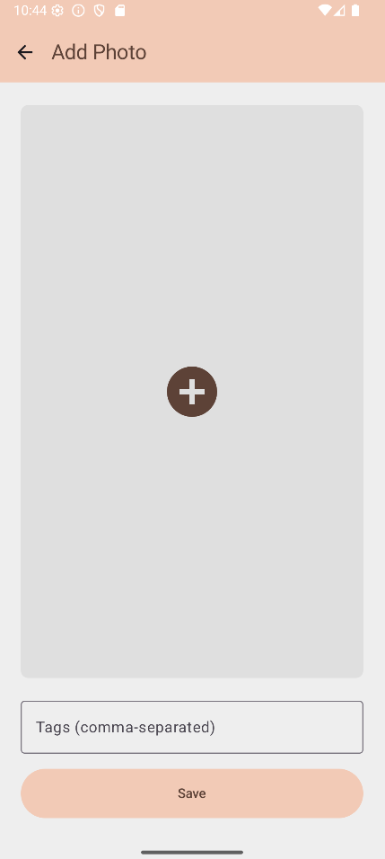
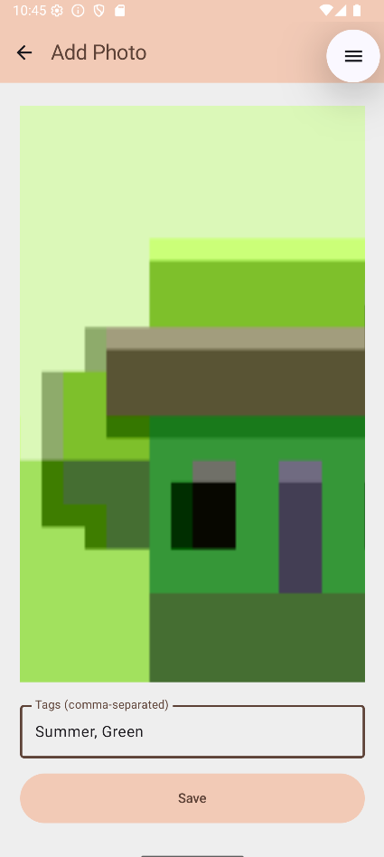

# Miranda's Closet

**Miranda's Closet** is a simple and elegant Android app that helps you catalog your outfits and organize your wardrobe using photos and tags. Quickly snap pictures, assign tags (like "work", "casual", or "summer"), and filter your looks anytime with just a tap.

## Features

- 📷 **Take Outfit Photos**  
  Quickly capture images of your clothing or full outfits directly within the app.

- 🏷️ **Add Tags to Photos**  
  Assign custom tags to each image to categorize them by style, season, occasion, or any way you like.

- 🔍 **Filter by Tags**  
  Easily browse your wardrobe by selecting tags — see all your "vacation" looks or "formalwear" in one place.

## Screenshots

<table>
  <tbody>
    <tr>
        <td></td>
        <td></td>
        <td></td>
    </tr>
  </tbody>

</table>

## Getting Started

### Prerequisites

- Android 13.0 (API level 33) or higher
- Camera permission

### Installation

- Clone the repository and open it in Android Studio
- Download the latest APK from [releases](https://github.com/PBillodeau/mirandas-closet/releases)
